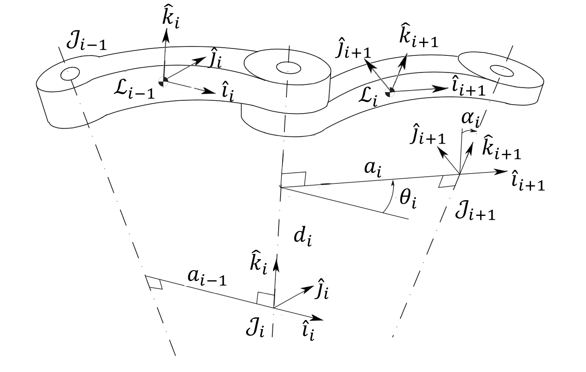
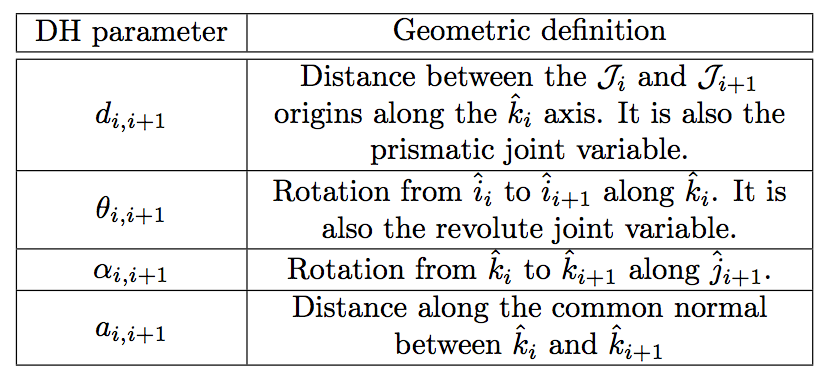

Quickstart
==========

SPART is a collection of MATLAB and Simulink functions/blocks. The Simulink blocks are contained into the SimulinkLibrary folder. The MATLAB functions are contained into different folders:

* KinDyn - contains the general Kinematics and Dynamics.
* Utils - contains conversions between different orientation parametrization.

Most of these functions require a description of the spacecraft-manipulator system. This is provided using a MATLAB structure. Here is an example of how this looks like for a 2-link manipulator system. 

.. code:: matlab
	
	%--- Define manipulator data ---%

	%Number of joints/links
	data.n=2;

	%First joint
	data.man(1).type=0;
	data.man(1).DH.d = 0;
	data.man(1).DH.alpha = 0;
	data.man(1).DH.a = 1;
	data.man(1).DH.theta = 0;
	data.man(1).b = [data.man(1).DH.a/2;0;0];
	data.man(1).mass=2;
	data.man(1).I=eye(3)/10;

	%Second joint
	data.man(2).type=0;
	data.man(2).DH.d = 0;
	data.man(2).DH.alpha = 0;
	data.man(2).DH.a = 1;
	data.man(2).DH.theta = 0;
	data.man(2).b = [data.man(2).DH.a/2;0;0];
	data.man(2).mass=2;
	data.man(2).I=eye(3)/10;

	%Final end-effector frame rotation about z axis
	data.EE.theta=0;

	%Firts joint location with respect to base
	data.base.T_L0_J1=[eye(3),[1;0;0];zeros(1,3),1];

	%Base-spacecraft inertia matrix
	data.base.mass=10;
	data.base.I=eye(3);

The data structure has 3 fields:
	* data.n -- Number of links.
	* data.man(i) -- Describes the ith link/joint.
		* data.man(i).type -- Type of joint. 0 for a revolute joint, 1 for a prismatic joint.
		* data.man(i).DH -- Denavit-Hartenberg parameters. Definitions are included below.
		* data.man(i).b -- Vector from the Center-of-Mass of the link to the next joint in the local frame.
		* data.man(i).mass -- Mass of the link.
		* data.man(i).I -- Inertia matrix of the link.
	* data.base -- Describes the base-spacecraft.
		* data.base.T_L0_J1 -- Homogeneous transformation matrix from the first 
		* data.base.mass -- Mass of the base-spacecraft.
		* data.base.I -- Inertia matrix of the base-spacecraft
	* data.EE -- Provides additional information about the end-effector
		* data.EE.theta -- Final rotation about the z axis. Last joint DH parameters are not enough to completely specify the orientation of the x and y end-effector axes.

The definitions of the Denavit-Hartenberg (DH) parameters and the other geometric magnitudes are as follows:

   Denavit-Hertenberg parameters.

   Denavit-Hartenberg parameters and their geometric definition.

.. figure:: Figures/GenLinksJoints.png
   :scale: 50 %
   :align: center
   :alt: DH text parameters

   Schematic disposition of links and joints.

Once the manipulator system has been defined we can then specify the configuration of the spacecraft manipulator system as follows.

.. code:: matlab

	%Base position
	R0=eye(3);  %Rotation from Base-spacecraft to inertial
	r0=[0;0;0]; %Position of the base-spacecraft

	%Joint variables
	qm=deg2rad([25;25]);

	%Velocities
	q0dot=[deg2rad(10);deg2rad(5);deg2rad(1);1;2;3];
	qmdot=deg2rad([40;55]);

Then we can start calling some functions. For example the kinematic function:

.. code:: matlab

	%Kinematics
	[RJ,RL,r,l,e,t0,tm,Bij,Bi0,P0,pm,TEE]=Kinematics_Serial(R0,r0,qm,q0dot,qmdot,data);

The output of the function is as follows:
	* RJ -- Joint 3x3 rotation matrices.
	* RL -- Links 3x3 rotation matrices.
	* r -- Links positions.
	* l -- Joints positions.
	* e -- Joints rotations axis.
	* t0 -- Base-spacecraft twist vector
	* tm -- Manipulator twist vector.
	* Bij -- Twist-propagation matrix (for manipulator i>0 and j>0).
	* Bi0 -- Twist-propagation matrix (for i>0 and j=0).
	* P0 -- Base-spacecraft twist-propagation vector.
	* pm -- Manipulator twist-propagation vector.
	* TEE -- End-Effector Homogeneous transformation matrix.

