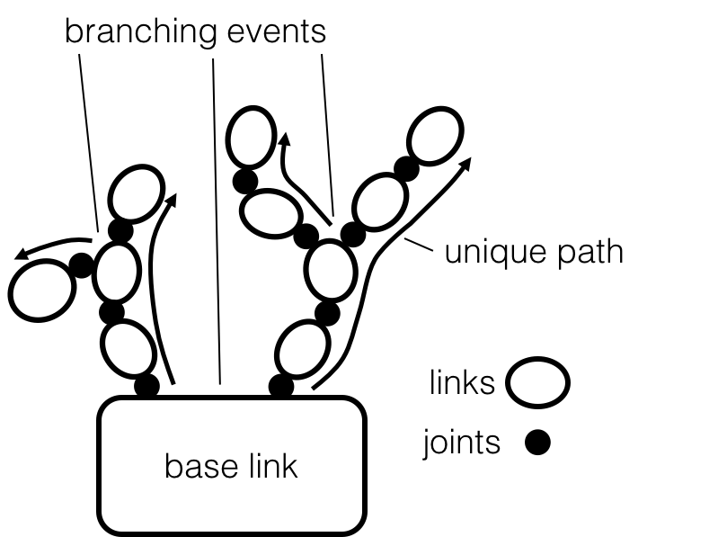
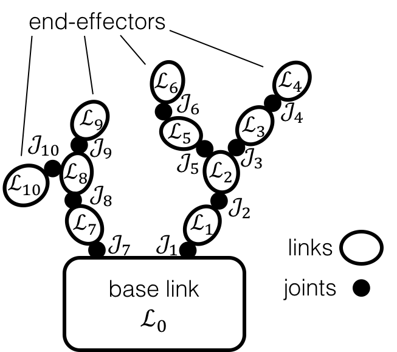

==============
SPART Tutorial
==============

This SPART tutorial will cover the basic operation of the library. Before starting make sure you have correctly installed and configured SPART (:doc:`/Installation`).

Getting the Robot Model
=======================

The first step is to create the robot model. This model contains all the kinematic and dynamic data of the robot. Take a look at (:doc:`/Robot_Model`) to get a detailed description of how this model is structured.

There are 3 different ways to create the robot model:
	* Use an Unified Robot Description Format (URDF file). Check (:doc:`/URDF`) for a description on how to convert a URDF file into a SPART robot model.
	* Use the Denavit-Hartenberg (DH) convention to define the geometry of your robot. Check (:doc:`/DH`) for a description on how to convert a URDF file into a SPART robot model.
	* Manually create the robot model. Refer to (:doc:`/Robot_Model`) for further guidance.

Weather if you choose to start from a URDF file or from a DH description this tutorial code can be found either in ``examples/URDF_Tutorial/URDF_Tutorial.m`` or in ``examples/DH_Tutorial/DH_Tutorial.m``.

Regular numbering scheme
========================

A multibody system refers to a collection of bodies coupled by joints. The bodies of the system – known as links – are arranged in kinematic
chains which can be of two types:
	* Kinematic trees (also known as open-loop kinematic chains) when the path between any two bodies is unique.
	* Closed-loop kinematic chains, when the path between any two bodies is not unique.

SPART is only designed for *kinematic trees*.

   Illustration of a generic kinematic tree.

Additionally, SPART uses a regular numbering scheme, identifying each link and joint with a number. Joints and links are denoted by :math:`\mathcal{J}_{i}` and :math:`\mathcal{L}_{i}`, respectively. A link :math:`\mathcal{L}_{i}` may be connected to an arbitrary number of links via an equal number of joints. Given the assumption of a kinematic tree topology, only one of these links lies within the path connecting :math:`\mathcal{L}_{i}` and the base link. This link is referred to as the *parent link* of :math:`\mathcal{L}_{i}` and the joint connecting these two links is denoted by :math:`\mathcal{J}_{i}`. The rest of links directly connected to link :math:`\mathcal{J}_{i}` are called *child links* of :math:`\mathcal{L}_{i}`. Each link :math:`\mathcal{L}_{i}` --- with the except of the base link --- has one and only one parent, but can have an arbitrary number of children links. When a link has more than one children this is called a *branching event*.

In a regular number scheme each children link is given a higher number than its parent, with the base link given the number :math:`0`. If the kinematic tree has multiple branches, multiple numbering options exist and they can be chosen arbitrarily among them.

   Illustration of a regular numbering scheme.

From this point onwards, the notation :math:`i+1` and :math:`i-1` is abused to denote the child and parent link or joint even when they are not sequentially numbered. Additionally, the last joint and link on a branch will be generally denoted by :math:`n`. This last link is also referred to as *end-effector*. 

Kinematics
==========

After creating the robot model the next step is to compute the kinematics of the multibody system.

First we need to define the position and orientation of the base with respect to the inertial Cartesian Coordinate System.

.. code-block:: matlab

	%Base position
	R0=eye(3);  %Rotation from base-link with respect to the inertial CCS
	r0=[0;0;0]; %Position of the base-link with respect to the origin of the inertial frame, projected in the inertial CCS

Also the joint variables need to be defined for all active joints.

.. code-block:: matlab

	%Joint variables [rad or m]
	qm=[0;0;0;0;0]; %Adjust the length according to your robot model

The the ith joint is revolute `qm(i)` denotes a rotation whether if the ith joint is prismatic `qm(i)` denotes a translation.

The set of `R0,r0,qm` constitute a set of variables :math:`\mathcal{Q}` that fully define the state of the multibody system,

.. math::

	\mathcal{Q}=\left\lbrace\mathbf{R}_{0},\mathbf{r}_{0},q_{1},\ldots,q_{n}\right\rbrace

with this set usually referred to as *generalized variables*.

We can now compute the kinematics of the system.

.. code-block:: matlab

	%Kinematics
	[RJ,RL,rJ,rL,e,g]=Kinematics(R0,r0,qm,robot);

The output of the function is as follows:
	* RJ -- Joint 3x3 rotation matrices of the joint  -- as a [3x3xn] matrix.
	* RL -- Links 3x3 rotation matrices -- as a [3x3xn] matrix.
	* rJ -- Positions of the joints projected in the inertial frame -- as a [3xn] matrix.
	* rL -- Positions of the links projected in the inertial frame -- as a [3xn] matrix.
	* e -- Joint rotation/sliding axis projected in the inertial frame -- as a [3xn] matrix.
	* g -- Vector from the origin of the origin of the ith joint to origin of the ith link projected in the inertial frame -- as a [3xn] matrix. 

The geometric definitions of these quantities are shown in the following figure.

   Schematic disposition of a generic link and its associated joint.

If you change the joint variables ``qm`` or base-link position ``r_{0}`` and orientation ``R_{0}`` and then re-run the kinematic function ``Kinematics`` you will get the new positions and orientations with that particular multibody configuration.

.. code-block:: matlab

	%Joint variables [rad]
	qm=[45;10;-45;20;-90]*pi/180;

	%Kinematics
	[RJ,RL,rJ,rL,e,g]=Kinematics(R0,r0,qm,robot);

SPART also allows symbolic computation. To obtain symbolic expressions just define the generalized variables as symbolic.

.. code-block:: matlab

	%Joint variables [rad]
	qm=sym('qm',[robot.n_q,1],'real');

	%Base-link position
	r0=sym('r0',[3,1],'real');

	%Base-link orientation
	Euler_Ang=sym('Euler_Ang',[3,1],'real');
	R0 = Angles321_DCM(Euler_Ang)';

	%Kinematics
	[RJ,RL,rJ,rL,e,g]=Kinematics(R0,r0,qm,robot);

.. warning::
   To obtain symbolic expressions all inputs must be symbolic. Otherwise, errors can occur.

Differential Kinematics
=======================

The linear and angular velocity of a link with respect to the inertial frame, projected into the inertial CCS, is encapsulated in a *twist* 6x1 column matrix.

.. math::

	\mathbf{t}_{i}=\begin{bmatrix}\mathbf{\omega}_{i}\\ \dot{\mathbf{r}}_{i}\end{bmatrix}

The twist can be recursively propagated, from a link to the next one, using the 3x3 :math:`\mathbf{B}_{ij}` twist--propagation matrix and the 6x1 :math:`\mathbf{p}_{i}` twist--propagation vector as follows:

.. math::
	
	\mathbf{t}_{i}=\mathbf{B}_{ij}\mathbf{t}_{j}+\mathbf{p}_{i}\dot{q}_{i}

These matrices, which form the basis of the differential kinematics, can be computed with the `DiffKinematics` functions as follows:

.. code-block:: matlab

	%Differential Kinematics
	[Bij,Bi0,P0,pm]=DiffKinematics(R0,r0,rL,e,g,robot);

The output of the differential kinematics are as follows:
	* Bij -- Twist--propagation [6x6] matrix (for manipulator i>0 and j>0).
	* Bi0 -- Twist--propagation [6x6] matrix (for i>0 and j=0).
	* P0 -- Base--link twist--propagation [6x6] matrix.
	* pm -- Manipulator twist--propagation [6x1] vector.

The set of velocities :math:`\mathbf{u}` is known as the generalized velocities, and contain the base-link velocities :math:`\mathbf{u}_{0}` and the joint velocities :math:`\mathbf{u}_{m}`. 

.. math::

	\mathbf{u} = \begin{bmatrix}\mathbf{u}_{0} \\ \mathbf{u}_{m} \end{bmatrix}

With the base-link and joint velocities defined as:

.. math::

	\mathbf{u}_{0} = \begin{bmatrix}\mathbf{\omega}^{\mathcal{L}_{0}}_{0} \\ \dot{\mathbf{r}}_{0} \end{bmatrix}

	\mathbf{u}_{m} = \begin{bmatrix}\dot{q}_{1} \\ \vdots \\ \dot{q}_{n} \end{bmatrix}

Note that :math:`\mathbf{\omega}^{\mathcal{L}_{0}}_{0}` denotes the angular velocity of the base-link with respect to the inertisl frame, projected in the base-link body-fixed CCS.

For the base-link, the twist is computed only using a modified 6x6 :math:`\mathbf{P}_{0}` twist-propagation matrix.

.. math::
	
	\mathbf{t}_{0}=\mathbf{P}_{0}u_{0}

With this quantities the velocities of all the links can be determined.
	
.. code-block:: matlab

	%Velocities (joint space)
	u0=zeros(6,1); %Base-link velocity [wx,wy,wz,vx,vy,vz].
	um=[4;-1;5;2;1]*pi/180; %Joint velocities (adjust the length according to your robot model)

	%Velocities (operational space)
	[t0,tL]=Velocities(Bij,Bi0,P0,pm,u0,um,robot);

The output of the operational space velocities are as follows:
	* t0 -- Base--link twist vector [wx,wy,wz,vx,vy,vz] projected in the inertial CCS.
	* tL -- Manipulator twist vector [wx,wy,wz,vx,vy,vz] projected in the inertial CCS.

The Jacobian of a point 'x' maps the joint space velocities :math:`\mathbf{u}` into the operational space velocities of that point :math:`\mathbf{t}_{x}`.

.. math::
	
	\mathbf{t}_{x}=\mathbf{J}_{0x}\mathbf{u}_{0}+\mathbf{J}_{mx}\mathbf{u}_{m}

The analytical Jacobians of the ith link of the multibody system can be computed as follows:

.. code-block:: matlab

	%Jacobian of the ith Link
	[J0i, Jmi]=Jacob(rL(1:3,i),r0,rL,P0,pm,i,robot);

And to compute the Jacobian of a point 'x' in the ith link:

.. code-block:: matlab

	%Jacobian of the a point x in the ith link
	%rx is the position of the point, projected into the inertial CCS
	[J0x, Jmx]=Jacob(rx(1:3),r0,rL,P0,pm,i,robot);

Equations of Motion and Inertia Matrices
========================================

The generic equations of motion can be written as follows:

.. math::
	
	\mathbf{H}\left(\mathcal{Q}\right)\dot{\mathbf{u}}+C\left(\mathcal{Q},\mathbf{u}\right)\mathbf{u}=\mathbf{\tau}

with :math:`\mathbf{H}` being the Generalized Inertia Matrix (GIM), :math:`\mathbf{C}` the Convective Inertia Matrix (CIM) and :math:`\mathbf{\tau}` the generalized joint forces.

The contributions of the base-link and the manipulator can be made explicit when writing the equations of motion.

.. math::
	
	\left[\begin{array}{cc} \mathbf{H}_{0} & \mathbf{H}_{0m}\\ \mathbf{H}_{0m}^{T} & \mathbf{H}_{m} \end{array}\right]
	\left[\begin{array}{c} \dot{\mathbf{u}}_{0}\\ \dot{\mathbf{u}}_{m} \end{array}\right]+
	\left[\begin{array}{cc} \mathbf{C}_{0} & \mathbf{C}_{0m}\\ \mathbf{C}_{m0} & \mathbf{C}_{m} \end{array}\right]
	\left[\begin{array}{c} \mathbf{u}_{0}\\ \mathbf{u}_{m} \end{array}\right]=
	\left[\begin{array}{c} \mathbf{\tau}_{0}\\ \mathbf{\tau}_{m} \end{array}\right]

These inertia matrices are computes as follows.

.. code-block:: matlab

	%Inertias projected in inertial frame
	[I0,Im]=I_I(R0,RL,robot);
	%Mass Composite Body matrix
	[M0_tilde,Mm_tilde]=MCB(I0,Im,Bij,Bi0,robot);
	%Generalized Inertia matrix
	[H0, H0m, Hm] = GIM(M0_tilde,Mm_tilde,Bij,Bi0,P0,pm,robot);
	%Generalized Convective Inertia matrix
	[C0, C0m, Cm0, Cm] = CIM(t0,tL,I0,Im,M0_tilde,Mm_tilde,Bij,Bi0,P0,pm,robot);

Although the equations of motion can be used to solve the forward dynamic problem (determining the motion of the system given a set of applied forces :math:`\mathbf{\tau}\rightarrow\dot{\mathbf{u}}`) and the inverse dynamic problem (determining the forces required to produce a prescribe motion :math:`\dot{\mathbf{u}}\rightarrow\mathbf{\tau}`) there are more computationally efficient ways of doing so.

Forward Dynamics
================

To solve the forward dynamics you will need to specify the forces acting on the multibody system. There are two ways of specifying them. Choose the one that is easier for your particular application (or both of them simultaneously).

The joint forces :math:`\mathbf{\tau}` are the forces acting on the joints :math:`\mathbf{\tau}_{m}` (thus is a ``nx1`` column matrix) and also at the base-link :math:`\mathbf{\tau_{0}}` (thus a ``6x1`` column matrix). For :math:`\mathbf{\tau}_{0}`, as in the twist vector, the torques :math:`\mathbf{n}_{0}`, projected in the body-fixed CCS, come first and then come the forces :math:`\mathbf{f}_{0}`.

.. math::

	\mathbf{\tau}_{0}=\begin{bmatrix}\mathbf{n}^{\mathcal{L}_{0}}_{0}\\ \mathbf{f}_{0} \end{bmatrix}

Also, you can specify the wrenches :math:`\mathbf{w}` (torques and forces projected into the inertial CCS) that are applied at the center-of-mass of each link. Again these can be decomposed into base-link 6x1 wrenches :math:`\mathbf{w}_{0}` and manipulator ``6xn`` wrenches :math:`\mathbf{w}_{m}`.

.. math::

	\mathbf{w}_{i}=\begin{bmatrix}\mathbf{n}_{i}\\ \mathbf{f}_{i} \end{bmatrix}

Here is an example of how to define them:

.. code-block:: matlab

	%External forces
	wF0=zeros(6,1);
	wFm=zeros(6,data.n);

	%Joint torques
	tauq0=zeros(6,1);
	tauqm=zeros(robot.n_links,1);

After these forces are defined, a forward dynamic solver is available.

.. code-block:: matlab
	
	%Forward Dynamics
	[u0dot_FD,umdot_FD] = FD(tau0,taum,wF0,wFm,t0,tL,P0,pm,I0,Im,Bij,Bi0,u0,um,robot);

As an example, if you need to incorporate the weight of the links (with `z` being the vertical direction), set the wrenches as follows:

.. code-block:: matlab

	%Gravity
	g=9.8; %[m s-2]

	%External forces (includes gravity and assumes z is the vertical direction)
	wF0=zeros(6,1);
	wFm=zeros(6,robot.n_links);
	for i=1:robot.n_links
        wFm(6,i)=-robot.links(i).mass*g;
	end

Inverse Dynamics
================

For the inverse dynamics, the acceleration of the base-link and the joints need to be specified and then a function to compute the inverse dynamics is available.

.. code-block:: matlab
	
	%Accelerations
	u0dot=zeros(6,1);
	umdot=zeros(robot.n_q,1);

	%Accelerations
	[t0dot,tLdot]=Accelerations(t0,tL,P0,pm,Bi0,Bij,u0,um,u0dot,umdot,robot);

	%Inverse Dynamics - Flying base
	[tau0,taum] = ID(wF0,wFm,t0,tL,t0dot,tLdot,P0,pm,I0,Im,Bij,Bi0,robot);

If the base-link is left uncontrolled (floating-base case) and thus its acceleration is unknown a different routine is available.

.. code-block:: matlab
	
	%Accelerations
	umdot=zeros(robot.n_q,1);

	%Inverse Dynamics - Floating Base
	[taum_floating,u0dot_floating] = Floating_ID(wF0,wFm,Mm_tilde,H0,t0,tL,P0,pm,I0,Im,Bij,Bi0,u0,um,umdot,robot);

